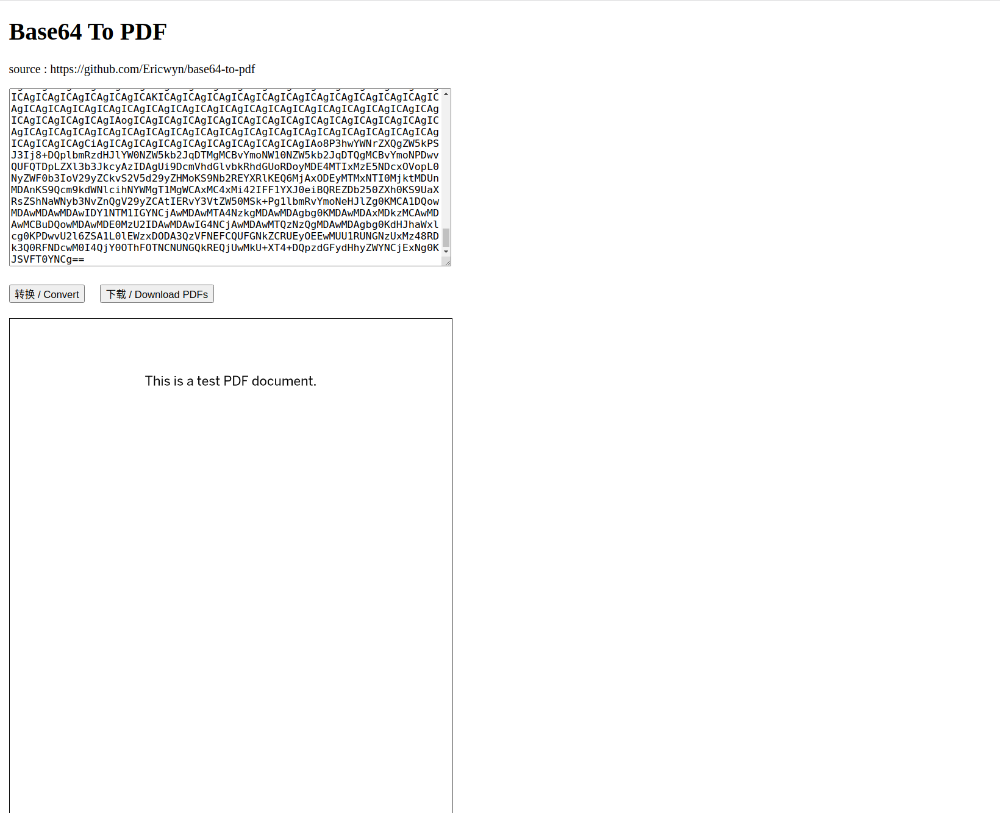

# Base64 Utils
## 介绍
一个将 base64 字符串直接转换为 PDF 或者 Image 并在线预览的工具。

- PDF 转换
  - 支持多页 pdf
  - 本地转换，无需上传数据
  - 支持下载转换后的 pdf
图片转换

访问地址: https://ericwyn.github.io/base64-utils

## Description

- Base64 To PDF

    A tool that directly converts base64 strings into PDFs and allows for online preview.

  - Supports multi-page PDFs
  - Performs conversions locally, no data upload required
  - Allows downloading of the converted PDF

- Base64 To Image
   
    

Access the tool at: https://ericwyn.github.io/base64-utils

## 截图 / Screenshot

